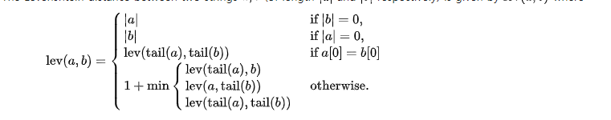
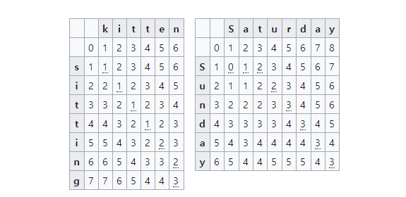
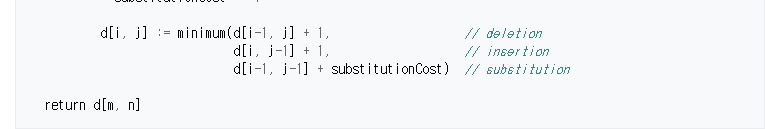

# 1. 레벤슈타인 알고리즘

#### * 문장 유사도 구할때 사용됨

```
편집거리 알고리즘 문자를 삽입, 삭제, 치환하여 
다른 문자열로 변형하는데 필요한 <최소> 횟수를 구하는 것
```

https://en.wikipedia.org/wiki/Levenshtein_distance


#### * 동적계획법(DP)기반으로 이뤄짐: 큰 문제를 부분으로 쪼개서 부분문제를 반복적으로 해결

```
피보나치 수열을 구할 때 이전 값2개를 더하면 된다는 것을 인지하고

3 계산된 값들을 계속 저장해나가면서 이전 값 2개만 더하는 연산을 반복해서 구하기
```


#### * 원리




```
str1 str2의 각 길이 +1에 해당하는 array를 만든 후

=> array의 각 칸의 값을 채워나가며 마지막 칸을 도출해내는 과정
```



min(deletion, insertion, substitution)으로 각 칸을 채워주기

#### * 코드 구현

<substitutionCost는 새로 추가되는 단어가 서로 같으면 0 틀리면 1>





