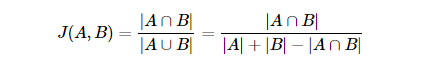
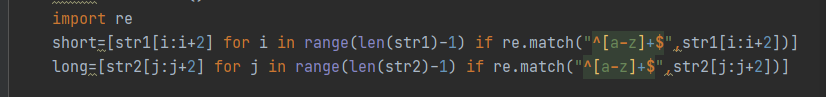
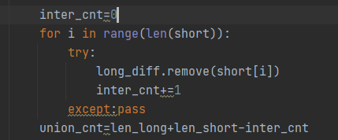

## 자카드 유사도



#### 개념

```
두 대상을 단어로 쪼갠 후 교집합과 합집합의 비율로 유사도를 나타냄

단어단위로 쪼갤 때 복수를 허용하는 중복(Multiset)집합 형태에서는 교집합을 구할 때 주의해야함

```

#### 코드예시

1. 정규표현식을 활용하여 알파벳 소문자만 포함하는 단어단위로 BoW를 형성

   




2. 중복집합 상황이기 때문에 set을 쓰지 않고 list상태에서 교집합을 찾아줌.

   short의 있는 원소를 long에서 찾고 발견되면 다음에 다시 count가 되지 않도록 remove해줌.



```
# 파이썬 코드

# # str1       str2      answer
# # FRANCE    french    16384
# # handshake  shake hands    65536
# # aa1+aa2       AAAA12    43690
# # E=M*C^2    e=m*c^2       65536
#
str1="E=M*C^22"
str2="e=m*c^2"

def jacc_coef(str1,str2):
    str1=str1.lower()
    str2=str2.lower()
    import re
    short=[str1[i:i+2] for i in range(len(str1)-1) if re.match("^[a-z]+$",str1[i:i+2])]
    long=[str2[j:j+2] for j in range(len(str2)-1) if re.match("^[a-z]+$",str2[j:j+2])]

    len_long=len(long)
    len_short=len(short)
    if (len_short==0) and (len_long==0):return 65536
    else:
        import copy
        if len_short > len_long: # 짧은 걸 찾아서 짧은 걸 기준으로 교집합을 찾아서 시간단축?
            short,long = long,short
        long_diff = copy.copy(long)

        inter_cnt=0
        for i in range(len(short)):
            try:
                long_diff.remove(short[i])
                inter_cnt+=1
            except:pass
        union_cnt=len_long+len_short-inter_cnt
 #교집합, 합집합을 직접 찾아서 저장하여 연산하는 것보다 +-계산으로 구하는 것이 빠르다고 생각했음
        jaccard=int((inter_cnt/union_cnt)*65536)
        return jaccard
print(jacc_coef(str1,str2))
```

