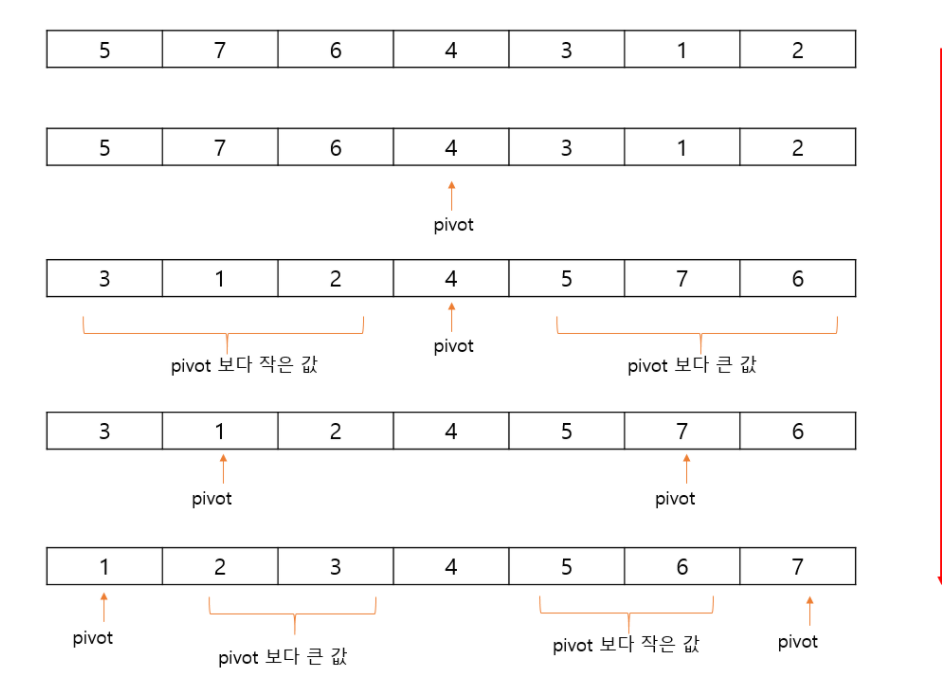

# 퀵 정렬 알고리즘
#### 1. 불안정 정렬, 비교 정렬

#### 2. 분할 정복 알고리즘의 하나(리스트를 비균등하게 분할함)

==> 문제를 작은 2개의 문제로 분리하고 각각 결과를 모아서 원래의 문제를 해결하는 방법

피벗(분할의 기준이 되는 원소), 순환호출을 구현해내는 것에 익숙해지자!
참고
https://www.acmicpc.net/board/view/31887

