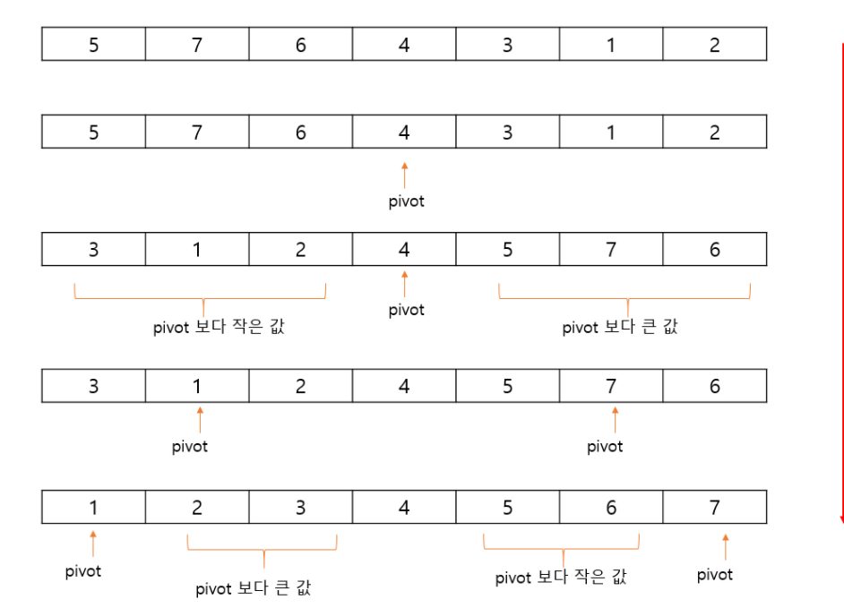

# 퀵 정렬 알고리즘
#### 1. 불안정 정렬, 비교 정렬

#### 2. 분할 정복 알고리즘의 하나(리스트를 비균등하게 분할함)

==> 문제를 작은 2개의 문제로 분리하고 각각 결과를 모아서 원래의 문제를 해결하는 방법

피벗(분할의 기준이 되는 원소), 순환호출을 구현해내는 것에 익숙해지자!
참고
https://www.acmicpc.net/board/view/31887

#### 3. 주의사항: 최악의 경우에는 N2의 시간 복잡도를 갖음

=> pivot을 설정하는 방식에 따라 성능에 큰 차이를 보임

=>  (정렬 대상이 정배열이나 역배열인 경우)

=>pivot을 첫째꺼 말고 가운데 꺼 쓰는 방법이 있음

=> 합병이나 힙이 일반적으로 사용하기 좋아보임





#### 파이썬 코드

```
# pivot을 맨 앞자리 사용했을 경우
#RecursionError: maximum recursion depth exceeded while calling a Python object
#정배열인 대상을 quick_sort했을 때 N^2라서 재귀호출에러가 발생했음.
#이 경우 pivot을 midpoint로 바꿔주니 해결됨


s=list(range(1,10000))
print(s)
def quick_sort(s):
    if len(s) <2: return s
    else:
        pivot=s[0]   # <<<<맨 앞을 피벗으로 줌
        left=[]
        right=[]
        for i in s:
            if i<pivot:
                left.append(i)
            elif i>pivot:
                right.append(i)
    return quick_sort(left)+[pivot]+quick_sort(right)
print(quick_sort(s))


# pivot을 가운데꺼 사용했을 경우

s=list(range(1,10000))
print(s)
def quick_sort(s):
    if len(s) <2: return s
    else:
        pivot=s[len(s)//2]  # <<<<minpoint를 피벗으로 줌
        left=[]
        right=[]
        for i in s:
            if i<pivot:
                left.append(i)
            elif i>pivot:
                right.append(i)
    return quick_sort(left)+[pivot]+quick_sort(right)
print(quick_sort(s))
```


