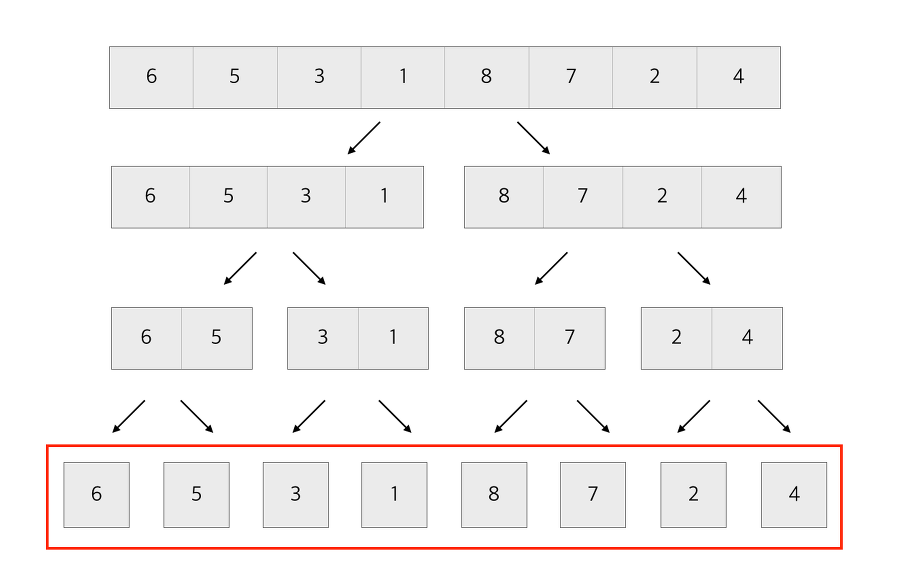

## 병합정렬 알고리즘(merge_sort)


#### 특징

```
* 분할&정복방식
  최소 단위로 분할한 뒤 분할 단위끼리 정렬해가며 다시 합치는 방식

* 시간복잡도: O(NlogN) 최악의 경우에도 (NlogN유지)

* 재귀호출을 이용하여 최소단위까지 분할
  분할된 값들을 merge함수로 집어넣고 순차적으로 합치는 방식
  연산 

* 합병정렬의 경우 기존 배열을 새롭겨 res라는 배열에 정렬하여 출력함.
  때문에 메모리를 추가적으로 사용해야된다는 단점이 존재.
  
* 복잡한 문제에서는 재귀호출 깊이를 늘려줘야함
  파이썬의 기본 재귀호출 깊이는 1000
  (단, pypy에서는 사용이 불가하다.)
    import sys
    sys.setrecursionlimit(10**6)
    
* 시간복잡도 문제에서는 input()도 굉장히 느린 함수임
	import sys
	sys.stdin.readline().rstrip()으로 대체할 수 있음
    (rstrip()으로 코딩테스트에서 테스트 케이스에 우측 여백이 있는 경우를 방지.)

```


https://zeddios.tistory.com/38



#### 파이썬 코드(백준2751)

```
nums=[-41, -11, -40, 9, -86]
def merge_sort(nums): #재귀호출 분할: 매개변수 nums
    if len(nums) <2: return nums #재귀호출 탈출조건: 매개변수의 길이
    else:
        mid=len(nums)//2
        left=nums[:mid] #[-41, -11] #[-41]
        print(left)  
        right=nums[mid:] #[-40, 9, -86] #[-11]
        print(right) 
        leftele=merge_sort(left) #재귀호출
        rigele=merge_sort(right)
    return merge(leftele,rigele)
def merge(lef,rig):  #정복하면서 병합
      #새로운 res배열을 만들어 값을 정렬시키므로 nums에 해당하는 메모리가 추가적으로 더 필요
    res = []

    i = j = 0
    print("합병 대상",lef)  #합병 대상 [-41]
    print("합병 대상",rig) #합병 대상 [-11]

    while len(lef)>i and len(rig) >j:
        if lef[i] <= rig[j]:
            res.append(lef[i])
            i+=1
        else:
            res.append(rig[j])
            j+=1
    if len(lef) > i:
        res.extend(lef[i:]) # 계속 비교해서 한쪽이 먼저 소진되어 버리면 남은 한쪽은 남은 걸 뒤에 붙여야함
    elif len(rig) > j:
        res.extend(rig[j:])
    print("합병 이후",res)  #합병 이후 [-41, -11]
    return res
```


#### 출력 결과

```
[-41, -11, -40, 9, -86]
[-41, -11]
[-40, 9, -86]					##leftele=merge_sort(left)이 rightele 보다
[-41]							##먼저 있기 때문에 제일 좌측 기준으로 먼저 분할하고 합병
[-11]
합병 대상 [-41]
합병 대상 [-11]
합병 이후 [-41, -11]
[-40]
[9, -86]
[9]
[-86]
합병 대상 [9]
합병 대상 [-86]
합병 이후 [-86, 9]
합병 대상 [-40]
합병 대상 [-86, 9]
합병 이후 [-86, -40, 9]
합병 대상 [-41, -11]
합병 대상 [-86, -40, 9]
합병 이후 [-86, -41, -40, -11, 9]
[-86, -41, -40, -11, 9]

Process finished with exit code 0

```


