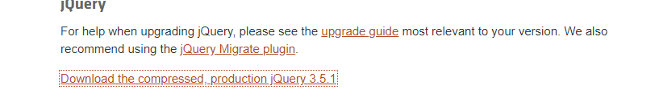

1. 표준 html 문서

   웹브라우저/운영체제가 다르더라도 동일하게 보이고 작동할 수 있도록 웹 표준을 만들었고,

   웹 표준을 따르는 문서를 표준 html문서라고 함.

   html처음에 실행시 나오는 틀이 표준화된 규격임 헤드,바디있고 헤드안에 메타있고...

2. 장고에는 template을 상속받게 됨

   기본 공통부분에 관한 것들을 작성한 base 템플릿을 작성후 나머지 템플릿에 상속시켜 중복을 줄이기

   2-1. templates 폴더 밑에 base.html파일 생성

   ```
   
   <!doctype html>
   <html lang="ko">
   <head>
       <!-- Required meta tags -->
       <meta charset="utf-8">
       <meta name="viewport" content="width=device-width, initial-scale=1, shrink-to-fit=no">
       <!-- Bootstrap CSS -->
       <link rel="stylesheet" type="text/css" href="">
       <!-- pybo CSS -->
       <link rel="stylesheet" type="text/css" href="">
       <title>Hello, mybo!</title>
   </head>
   <body>
   <!-- 기본 템플릿 안에 삽입될 내용 Start -->
   
   
   <!-- 기본 템플릿 안에 삽입될 내용 End -->
   </body>
   </html>
   ```

   

   2-2. 

   이 부분을 제외하고는 전부 공통, 저 사이에 개별적용 내용을 작성해야함

```


```

​	2-3. 하위 html 파일들 들어가서 공통부분 내용 이렇게 작성

```
 :이건 반드시 맨 윗줄에 써줘야함 주석들 있어도 무조건 맨위


개별내용

```

3. q_list.html에 질문 등록하기 버튼 만들기

   3-1.html에 버튼 만들기

   3-2urls.py에 매핑하기

   3-2views.py에서 질문생성폼 만들기

   ```
   from .forms import QuestionForm
   
   def question_create(request):
       form=QuestionForm()
       return render(request,"mybo/question_form.html",{'form':form})
   ```

   3-3 forms.py  &  question_form.html 만들기

   ```
   from django import forms
   from .models import Question
   
   #ModelForm:부모클래스(모델과 연결되어 있는 폼, 모델 폼을 저장하면 연결된
   # 모델의 데이터를 데이터베이스에 저장)
   # QuestionForm:자식 클래스를 생성
   # 여기서 model=Question이라고 지정해줘서 Question모델과 연결하고
   # fields=['subject','content'] 필드로는 subject와 content를 사용하겠다.
   class QuestionForm(forms.ModelForm):
       class Meta:
           model=Question
           fields=['subject','content']
   ```

   ```
   
   
   
   <div class="container">
       <h5 class="my-3 border-bottom pb-2">질문등록</h5>
       
       <form method="post" class="post-form my-3">
           
           {{ form.as_p }}
           <button type="submit" class="btn btn-primary">저장하기</button>
       </form>
   </div>
   
   
   ```

   ```
   <!--동일한 경로안에  있기 때문에 액션을 지정하지 않음
   submit을 눌러도 다른 url로 보내는 것이 아니라 현재 머물고 있는
   question_create로 보내서 다시 views.question_create로 감
   단, 이번에는 method가 지정되어 있기 때문에 post방식으로 보냄
   그래서 question_create메서드는 이번에 if post구문을 수행하면서
   객체를 생성하고 db에 저장한다음 redirect함수로 다시 index url로 연결함-->
   ```
   질문등록 내용수정      

     {{ form.as_p }} 이 부분을 밑의 코드로 바꾸면 이게 생김

   


   ```
           
               <div class="alert alert-danger" role="alert">
               
                   
                   <strong>{{ field.label }}</strong>
                   {{ field.errors }}
                   
               
               </div>
           
           <!-- 오류표시 End -->
           <div class="form-group">
               <label for="subject">제목</label>
               <input type="text" class="form-control" name="subject" id="subject"
                      value="{{ form.subject.value|default_if_none:'' }}">
           </div>
           <div class="form-group">
               <label for="content">내용</label>
               <textarea class="form-control" name="content"
                         id="content" rows="10">{{ form.content.value|default_if_none:'' }}</textarea>
           </div>
   ```

   

3-4 다시 views.py 수정

```
def question_create(request):
#     form=QuestionForm()
#     return render(request,"mybo/question_form.html",{'form':form})
    if request.method == 'POST':#post 방식일경우(주소가 화면에 표시 x)
        form = QuestionForm(request.POST)
        if form.is_valid():#데이터 양식 확인
            question = form.save(commit=False)
            #임시로 저장, 현재는 Question객체의 create_date값이 없는상태
            question.create_date = timezone.now()
            question.save()#완전히 저장
            return redirect('mybo:index')
    else:#get 방식일경우는 입력값 없이(주소가 화면에 표시 o)
        form = QuestionForm()
    context = {'form': form}
    return render(request, 'mybo/question_form.html', context)

```

3-5forms.py에서 질문등록화면 스타일 적용하기(부트스트랩 적용)

```
class QuestionForm(forms.ModelForm):
    class Meta:
        model=Question
        fields=['subject','content']
        widgets = {
            'subject': forms.TextInput(attrs={'class': 'form-control'}),
            'content': forms.Textarea(attrs={'class': 'form-control', 'rows': 10}),
        }
        
        labels={
            'subject': '제목',
            'content': '내용',
        }
```


4. 답변 폼 변경하기=> 입력이 없을때 등록안되도록

   1.forms.py로 이동 후 AnswerForm 만들기

   ```
   from .models import Question, Answer
   
   
   class AnswerForm(forms.ModelForm):
       class Meta:
           model = Answer
           fields = ['content']
           labels = {
               'content': '답변내용',
           }
   
   ```

   

2. views.py에서 answerform 변경

   ```
   from .forms import QuestionForm, AnswerForm
   
   
   ```

3. question_detail.html 수정

   ```
            여기밑에
           
            이거 삽입
   
       <div class="alert alert-danger" role="alert">
       
           
           <strong>{{ field.label }}</strong>
           {{ field.errors }}
           
       
       </div>
       
   ```

   

5. 네비게이션 바 추가하기

   1.base.html(모든페이지에 공통추가해야함)

```
<body> 밑으로

<nav class="navbar navbar-expand-lg navbar-light bg-light border-bottom">
    <a class="navbar-brand" href="">mybo</a>
    <button class="navbar-toggler ml-auto" type="button" data-toggle="collapse" data-target="#navbarNav"
        aria-controls="navbarNav" aria-expanded="false" aria-label="Toggle navigation">
        <span class="navbar-toggler-icon"></span>
    </button>
    <div class="collapse navbar-collapse flex-grow-0" id="navbarNav">
        <ul class="navbar-nav">
            <li class="nav-item ">
                <a class="nav-link" href="#">로그인</a>
            </li>
        </ul>
    </div>
</nav>

```

## 페이징, 내비게이션바

#### 1.내비게이션바:부트스트랩 js파일, jquery 직접추가

두 파일 static 파일로 넣기

1.bootstrap.min.js

2.jquery.com/download에서 jquery파일 우클릭, 다른이름으로 링크저장



3. static 폴더에 넣기

4. base.html endblock 밑에 

```
<!-- jQuery JS -->
<script src=""></script>
<!-- Bootstrap JS -->
<script src=""></script>
```

#### 2. 내비게이션바를 include로 포함시키기

1. templates 폴더에 navbar.html 만든후 넣고

```
<nav class="navbar navbar-expand-lg navbar-light bg-light border-bottom">
    <a class="navbar-brand" href="">mybo</a>
    <button class="navbar-toggler ml-auto" type="button" data-toggle="collapse" data-target="#navbarNav"
        aria-controls="navbarNav" aria-expanded="false" aria-label="Toggle navigation">
        <span class="navbar-toggler-icon"></span>
    </button>
    <div class="collapse navbar-collapse flex-grow-0" id="navbarNav">
        <ul class="navbar-nav">
            <li class="nav-item ">
                <a class="nav-link" href="#">로그인</a>
            </li>
        </ul>
    </div>
</nav>

```

2.base.html로 가서 endblock 밑에 이거 넣기

```
<!-- jQuery JS -->
<script src=""></script>
<!-- Bootstrap JS -->
<script src=""></script>

```


## 질문객체 만든 후 페이징하기

1. 질문객체 만들기

   python manage.py shell

   질문객체랑 장고유틸에서 타임존 import하고

   for 문으로 객체 생성! 들여쓰기, q.save 잊지말기

2. views.index로 가서 수정

paginator class에 대한 추가적인 학습링크

https://docs.djangoproject.com/en/3.1/ref/paginator/

```
from django.core.paginator import Paginator

def index(request):#request는 타고온 url 주소
    page=request.GET.get('page',1)# 페이지
    #get방식으로 페이지 요청이 있을때 페이지 값을 가져오는 구문
    #localhost:8000/mybo/ 주소처럼 page퍼러미터 값이 없으면 page=1을 기본값으로 하라는 의미
    #localhost:8000/mybo/?page=1


    #게시글 조회(작성일 기준 -가 있으므로 내림차순)
    #조회가 먼저 이후에 페이징
    question_list = Question.objects.order_by('-create_date')

    #인수로는 페이지로 나눌 대상, 한 페이지당 게시글 개수)
    paginator=Paginator(question_list, 10)
    page_obj=paginator.get_page(page)
    context={'question_list':page_obj}

    # return HttpResponse("안녕하세요. 제가 만든 홈페이지에 오신 것을 환영합니다.")
    return render(request, 'mybo/question_list.html', context)
```


3. question_list.html로 이동해서 수정하기

```
<!-- 페이징처리 시작 -->
    <ul class="pagination justify-content-center">
        <!-- 이전페이지 -->
        
        <li class="page-item">
            <a class="page-link" href="?page={{ question_list.previous_page_number }}">이전</a>
        </li>
        
<!--        이전페이지가 없으면 비활성화-->
        <li class="page-item disabled">
            <a class="page-link" tabindex="-1" aria-disabled="true" href="#">이전</a>
        </li>
        

        <!-- 페이지리스트 -->
        
        
<!-- page_number와 quest_list.number 구분하기! 페이지 리스트 끊어서 나오게 하는 기능 -->
        


            
            <li class="page-item active" aria-current="page">
                <a class="page-link" href="?page={{ page_number }}">{{ page_number }}</a>
            </li>
            
            <li class="page-item">
                <a class="page-link" href="?page={{ page_number }}">{{ page_number }}</a>
            </li>
            
        
        

        <!-- 다음페이지 -->
        
        <li class="page-item">
            <a class="page-link" href="?page={{ question_list.next_page_number }}">다음</a>
        </li>
        
        <!-- 다음페이지가 없으면 비활성화-->
        <li class="page-item disabled">
            <a class="page-link" tabindex="-1" aria-disabled="true" href="#">다음</a>
        </li>
        
        </ul>
        <!-- 페이징처리 끝 -->
```


```
게시판:12개 글
1페이지 12번째-3번째 글
2페이지 2번째 1번째 글
일련번호= 전체게시글개수-시작인덱스(게시물의 시작 번호)+1

시작인덱스(게시물의 시작 번호): 1페이지는 1번부터, 2페이지는 11번부터
12개의 게시글 페이지당 10개씩 출력하고자 할 때
1페이지 일련번호:12-1-(0-9)+1=12,11,...3
2페이지 일련번호:12-11-(0-9)+1=12,11,...3

```


4. question_list 앞에 번호가 생기게 만들기

mybo\templatetags 폴더 생성후

pybo_filter.py 작성

다시 question_list.html로 와서 extends base.html 바로 밑어

 입력

<tbody>밑에

<td>{{question_list.paginator.count|sub:question_list.start_index|sub:forloop.counter0|add:1}}</td>

```
        <tbody>
        
        
<!--테이블 한 줄의 content-->
        <tr>
<!--<td>{{ forloop.counter }}</td>-->
            <td>{{question_list.paginator.count|sub:question_list.start_index|sub:forloop.counter0|add:1}}</td>
            <td>
                <a href="">{{ question.subject }}</a>
            </td>
            <td>{{ question.create_date }}</td>
        </tr>
```

```
        <tbody>
        
        
<!--테이블 한 줄의 content-->
        <tr>
<!--<td>{{ forloop.counter }}</td>-->
            <td>{{question_list.paginator.count|sub:question_list.start_index|sub:forloop.counter0|add:1}}</td>
            <td>
                <a href="">{{ question.subject }}</a>
            </td>
            <td>{{ question.create_date }}</td>
        </tr>
```


에러나면 우선 서버 재구동해보기


#### question_list에서 질문 제목옆에 답변 개수 달기

```
제목 출력부분 찾아서 그 옆에

<span class="text-danger small ml-2"{{question.answer_set.count}}

```

 

sql명령문 예시

`select * from mybo_question;`


#### 로그인 로그아웃 기능

앱단위로? 사이트 단위로?

대규모 사이트 경우는 한 번 로그인하면 모든 앱을 이용할 수 있음

사이트 단위로 mybo(앱)가 아니라 **사이트 단위**로 만들어보자

django-admin startapp common

config/settings installedapp에 등록후

config/urls.py에서 url매핑

common/urls.py에서 다시 url 매핑


common/urls.py

```
from django.urls import path
from django.contrib.auth import views as auth_views
# 로그인 -> 데이터베이스 정상인지 확인 ->정상처리 or 에러메시지

app_name='common'
urlpatterns = [
    path('login/',auth_views.LoginView.as_view(template_name='common/login.html'), name='login')
    #registration 이란 디렉토리 밑에 login.html을 찾도록 만들어져있음
    # 하지만 우리는 common 디렉토리 안의 login.html로 연결하도록 수정할 것
]
```

templates 밑에 common 디렉토리 만든후 login.html만들기

```


<div class="container my-3">
    <form method="post" class="post-form" action="">
        
        
        <div class="form-group">
            <label for="username">사용자ID</label>
            <input type="text" class="form-control" name="username" id="username"
                   value="{{ form.username.value|default_if_none:'' }}">
        </div>
        <div class="form-group">
            <label for="password">비밀번호</label>
            <input type="password" class="form-control" name="password" id="password"
                   value="{{ form.password.value|default_if_none:'' }}">
        </div>
        <button type="submit" class="btn btn-primary">로그인</button>
    </form>
</div>


```

templates 밑에 form_errors.html 만들기

```

    
          <!-- 필드 오류를 출력한다. -->
            <div class="alert alert-danger">
                <strong>{{ field.label }}</strong>
                {{ error }}
            </div>
        
    
       <!-- 넌필드 오류를 출력한다. -->
        <div class="alert alert-danger">
            <strong>{{ error }}</strong>
        </div>
    


```

config settings redirect추가해주기

```
LOGIN_REDIRECT_URL="/" #로그인 성공시 index 페이지로 이동
```

config urls.py로 가서  '/' 에 대한 url매핑 다시해주기

```
    path('',views.index, name='index'),
```

navbar.html로 가서 로그인 상태에서는 로그인 버튼이 로그아웃으로 바뀌도록 바꿔주기

```
            <li class="nav-item ">
                
                <a class="nav-link" href="">{{user.username}}로그아웃</a>
                
                <a class="nav-link" href="">로그인</a>
                
```

common urls.py에서 다시 " 이부분 매핑해주기

```
    path('logout/', auth_views.LogoutView.as_view(), name='logout')
```

이후 config settings 가서 다시 logout redirect하기

```
LOGOUT_REDIRECT_URL="/"
```

