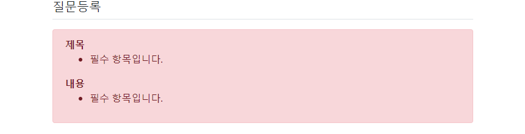

1. 표준 html 문서

   웹브라우저/운영체제가 다르더라도 동일하게 보이고 작동할 수 있도록 웹 표준을 만들었고,

   웹 표준을 따르는 문서를 표준 html문서라고 함.

   html처음에 실행시 나오는 틀이 표준화된 규격임 헤드,바디있고 헤드안에 메타있고...

2. 장고에는 template을 상속받게 됨

   기본 공통부분에 관한 것들을 작성한 base 템플릿을 작성후 나머지 템플릿에 상속시켜 중복을 줄이기

   2-1. templates 폴더 밑에 base.html파일 생성

   ```
   
   <!doctype html>
   <html lang="ko">
   <head>
       <!-- Required meta tags -->
       <meta charset="utf-8">
       <meta name="viewport" content="width=device-width, initial-scale=1, shrink-to-fit=no">
       <!-- Bootstrap CSS -->
       <link rel="stylesheet" type="text/css" href="">
       <!-- pybo CSS -->
       <link rel="stylesheet" type="text/css" href="">
       <title>Hello, mybo!</title>
   </head>
   <body>
   <!-- 기본 템플릿 안에 삽입될 내용 Start -->
   
   
   <!-- 기본 템플릿 안에 삽입될 내용 End -->
   </body>
   </html>
   ```

   

   2-2. 

   이 부분을 제외하고는 전부 공통, 저 사이에 개별적용 내용을 작성해야함

```


```

​	2-3. 하위 html 파일들 들어가서 공통부분 내용 이렇게 작성

```
 :이건 반드시 맨 윗줄에 써줘야함 주석들 있어도 무조건 맨위


개별내용

```

3. q_list.html에 질문 등록하기 버튼 만들기

   3-1.html에 버튼 만들기

   3-2urls.py에 매핑하기

   3-2views.py에서 질문생성폼 만들기

   ```
   from .forms import QuestionForm
   
   def question_create(request):
       form=QuestionForm()
       return render(request,"mybo/question_form.html",{'form':form})
   ```

   3-3 forms.py  &  question_form.html 만들기

   ```
   from django import forms
   from .models import Question
   
   #ModelForm:부모클래스(모델과 연결되어 있는 폼, 모델 폼을 저장하면 연결된
   # 모델의 데이터를 데이터베이스에 저장)
   # QuestionForm:자식 클래스를 생성
   # 여기서 model=Question이라고 지정해줘서 Question모델과 연결하고
   # fields=['subject','content'] 필드로는 subject와 content를 사용하겠다.
   class QuestionForm(forms.ModelForm):
       class Meta:
           model=Question
           fields=['subject','content']
   ```

   ```
   
   
   
   <div class="container">
       <h5 class="my-3 border-bottom pb-2">질문등록</h5>
       
       <form method="post" class="post-form my-3">
           
           {{ form.as_p }}
           <button type="submit" class="btn btn-primary">저장하기</button>
       </form>
   </div>
   
   
   ```

   ```
   <!--동일한 경로안에  있기 때문에 액션을 지정하지 않음
   submit을 눌러도 다른 url로 보내는 것이 아니라 현재 머물고 있는
   question_create로 보내서 다시 views.question_create로 감
   단, 이번에는 method가 지정되어 있기 때문에 post방식으로 보냄
   그래서 question_create메서드는 이번에 if post구문을 수행하면서
   객체를 생성하고 db에 저장한다음 redirect함수로 다시 index url로 연결함-->
   ```
   질문등록 내용수정      

     {{ form.as_p }} 이 부분을 밑의 코드로 바꾸면 이게 생김

   


   ```
           
               <div class="alert alert-danger" role="alert">
               
                   
                   <strong>{{ field.label }}</strong>
                   {{ field.errors }}
                   
               
               </div>
           
           <!-- 오류표시 End -->
           <div class="form-group">
               <label for="subject">제목</label>
               <input type="text" class="form-control" name="subject" id="subject"
                      value="{{ form.subject.value|default_if_none:'' }}">
           </div>
           <div class="form-group">
               <label for="content">내용</label>
               <textarea class="form-control" name="content"
                         id="content" rows="10">{{ form.content.value|default_if_none:'' }}</textarea>
           </div>
   ```

   

3-4 다시 views.py 수정

```
def question_create(request):
#     form=QuestionForm()
#     return render(request,"mybo/question_form.html",{'form':form})
    if request.method == 'POST':#post 방식일경우(주소가 화면에 표시 x)
        form = QuestionForm(request.POST)
        if form.is_valid():#데이터 양식 확인
            question = form.save(commit=False)
            #임시로 저장, 현재는 Question객체의 create_date값이 없는상태
            question.create_date = timezone.now()
            question.save()#완전히 저장
            return redirect('mybo:index')
    else:#get 방식일경우는 입력값 없이(주소가 화면에 표시 o)
        form = QuestionForm()
    context = {'form': form}
    return render(request, 'mybo/question_form.html', context)

```

3-5forms.py에서 질문등록화면 스타일 적용하기(부트스트랩 적용)

```
class QuestionForm(forms.ModelForm):
    class Meta:
        model=Question
        fields=['subject','content']
        widgets = {
            'subject': forms.TextInput(attrs={'class': 'form-control'}),
            'content': forms.Textarea(attrs={'class': 'form-control', 'rows': 10}),
        }
        
        labels={
            'subject': '제목',
            'content': '내용',
        }
```


4. 답변 폼 변경하기=> 입력이 없을때 등록안되도록

   1.forms.py로 이동 후 AnswerForm 만들기

   ```
   from .models import Question, Answer
   
   
   class AnswerForm(forms.ModelForm):
       class Meta:
           model = Answer
           fields = ['content']
           labels = {
               'content': '답변내용',
           }
   
   ```

   

2. views.py에서 answerform 변경

   ```
   from .forms import QuestionForm, AnswerForm
   
   
   ```

3. question_detail.html 수정

   ```
            여기밑에
           
            이거 삽입
   
       <div class="alert alert-danger" role="alert">
       
           
           <strong>{{ field.label }}</strong>
           {{ field.errors }}
           
       
       </div>
       
   ```

   

5. 네비게이션 바 추가하기

   1.base.html(모든페이지에 공통추가해야함)

```
<body> 밑으로

<nav class="navbar navbar-expand-lg navbar-light bg-light border-bottom">
    <a class="navbar-brand" href="">mybo</a>
    <button class="navbar-toggler ml-auto" type="button" data-toggle="collapse" data-target="#navbarNav"
        aria-controls="navbarNav" aria-expanded="false" aria-label="Toggle navigation">
        <span class="navbar-toggler-icon"></span>
    </button>
    <div class="collapse navbar-collapse flex-grow-0" id="navbarNav">
        <ul class="navbar-nav">
            <li class="nav-item ">
                <a class="nav-link" href="#">로그인</a>
            </li>
        </ul>
    </div>
</nav>

```

