1. 
2. cmd
3. cd\
4. mkdir venvs
     4.cd venvs
5. python -m venv mysite
     ---------------------가상환경 생성---------------
       6.cd my*
       7.cd Scr*
       8.activate
       (mysite) C:\venvs\mysite\Scripts>
       --------------------가상환경에 입장--------------
       9.pip install django==3.1.3
6. python -m pip install --upgrade pip
   ------------------장고설치&pip업그레이드-------
7. cd\
8. mkdir project
9. cd project
   ------------프로젝트 디렉토리 생성----------------
10. exit
11. cmd
12. C:\Users\i>cd\project
13. C:\project>C:\venvs\mysite\Scripts\activate
        18.(mysite) C:\project>mkdir mysite
        19.(mysite) C:\project>cd mysite
        20.(mysite) C:\project\mysite>django-admin startproject config .
        21.(mysite) C:\project\mysite>deactivate
14. C:\project\mysite>dir/w 명령 수행시, [config]와 manage.py가 있어야 함.
15. cd con*
16. C:\project\mysite\config>dir/w
        --------------프로젝트 구성 완료----------------------

#### 2. mybo 앱 생성

#### 

django-admin startapp (앱이름)

===============================================

#### 3. 장고 웹 서버 구동, 

1. C:\venvs\mysite\Scripts\activate
2. (mysite) C:\project\mysite\config>cd..
3. (mysite) C:\project\mysite>python manage.py runserver
Watching for...
You have 18 unapplied migration(s)....
Django version 3.1.3, using settings 'config.settings'
Starting development server at http://127.0.0.1:8000/
Quit the server with CTRL-BREAK.


=================================================

####  4. url 매핑, views파일 index메소드 정의

**config/urls.py 수정**

from mybo import views

 path('mybo/',view.index),

##### **웹브라우저를 띄운 후** 

http://127.0.0.1:8000/mybo주소를 입력

**urls 경로 변경**

```
config\urls.py
from django.urls import path, include
path('mybo/',include('mybo.urls')),


mybo\urls.py
from . import views

path("",views.index)
```

##### views.py

```
from django.http import HttpResponse

def index(request):
    return HttpResponse('휴 힘들다')
```


#### 5. D

config\settings.py에 

*DATABASES항목: 자료구조 json(dict안에 dict)
*sqlite는 mysql을 슬림화 시킨 미니데이타베이스
DATABASES = {
    'default': {
        'ENGINE': 'django.db.backends.sqlite3',
        'NAME': BASE_DIR / 'db.sqlite3',
    }
}

##### 필수: INSTALLED_APPS에 앱 등록하기

```
config\settings.py 에서

INSTALLED_APPS=[
	'mybo.apps.MyboConfig'
]
```

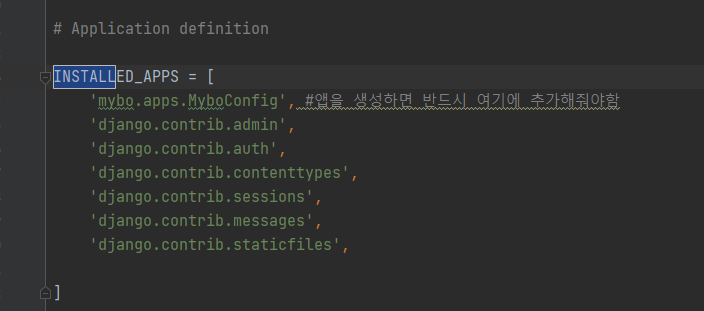


#### 6. runserver했을 때 경고메시지

admin, auth, sessions 등의 앱이 필요로하는 테이블을 생성해야함
테이블(학교)? 데이터(학생1명)를 저장하기 위한 데이터 집합의 모음
데이터베이스(전국의 학교)는 테이블,...의 모음

데이터베이스관리시스템:데이터베이스를 관리하는 프로그램
sqlite, 몽고, mysql, mssql, oracle,...

#### 7.DB관리

```
makemigrations: models.py에서 적용한 변경사항이나 추가된 혹은 삭제된 사항들을 감지하여 파일로 생성
migrate: 적용되지 않은 migrations들을(설정값들을) 적용시키는 역할


즉, makimigrations는 장고에서 제공하는 모델의 변경사항들을 감지하고 기록하는 역할을 하며 migrate는 그러한 기록된 파일들과 설정값들을 읽어서 그 변경사항을 db에 저장하는 역할을 한다.
```

**python manage.py migrate**
sqlite 설치 -> DB Browser for SQLite(도구) -> 데이터관리
sqlitebrowser.org/dl

local C => programfiles => db => dbbrowser for sqlite 바탕화면 바로가기 만들기

파일메뉴=>데이터베이스열기=> project\mysite\dq.sqlite3열기
원래는 db조작하려면 quary문을 배워야 함
-sql을 모르는 왕초보도 장고의 ORM(Object Relational Mapping)
(파이썬으로 데이터 작업을 할 수 있는 ORM이 우리를 대신하여 SQL문 생성->실행)
quary문의 단점:쿼리문의 일관성이 없음, 잘못된 퀴리문의 실행으로 인해 시스템이 저하될 수 있음.
db를 변경하는 경우, 변경전에 작성된 퀴리문이 변경 후의 db에서 실행이 잘 안되는 경우가 발생할 수 있음
==> 그래서, 장고의 ORM은 위에 열거된 단점들을 극복

cf)
#### 8. 모델이란?
머신러닝 모델: 빅데이터 환경에서 데이터들 사이의 규칙(패턴)을 발견하여 함수(수식)을 생성
새롭게 입력된 값에 대한 예측값이나 분류결과를 도출해내기 위한 함수

장고에서의 모델: 데이터 관리(저장,검색...)
ex)장고 질문/답변 모댈: 질문/답변 데이터 관리 모델

질문모델구성요소:질문의 제목, 질문 내용, 질문 작성일...
답변모델구성요서: 질문, 답변내용,답변작성일 등

클라이언트가 남긴 질문, 답변들이 db에 저장

##### models.py 들어가서

class 정의하기
https://docs.djangoproject.com/en/3.0/ref/models/fields/#field-types여기서 참고

```
models.CharFiled(max_length=200)
models.TextField()
models.DateTimeField()

models.ForeignKey() #모델간의 연결을 적용시키는 함수 ex.질문과 답변 모델을 연결
```

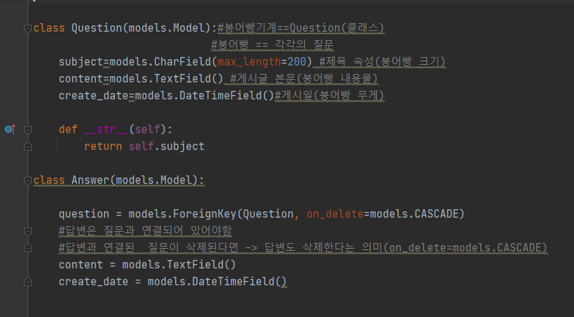


#### 9.장고는 모델을 이용하여 DB에 테이블 생성

=============================================================================

새롭게 테이블 생성/수정하는 경우에는 

먼저 테이블 작업을 위한 파일을 생성한 다음 테이블을 생성해야 함

`(mysite) C:\Users\19178\project\mysite>python manage.py makemigrations`

(테이블 작업을 위한 파일을 생성:  mybo\migrations\0001_initial.py이 생성됨)


=============================================================================

```
(mysite) C:\Users\19178\project\mysite>python manage.py makemigrations
Migrations for 'mybo':
  mybo\migrations\0001_initial.py

   - Create model Question
     - Create model Answer

(mysite) C:\Users\19178\project\mysite>
(mysite) C:\Users\19178\project\mysite>
```


=============================================================================

cmd

`(mysite) C:\Users\19178\project\mysite>python manage.py migrate`

테이블 생성

=============================================================================

```Operations to perform:
Operations to perform:
  Apply all migrations: admin, auth, contenttypes, mybo, sessions
Running migrations:

  Applying mybo.0001_initial... OK
```

=> 테이블이 생성됨


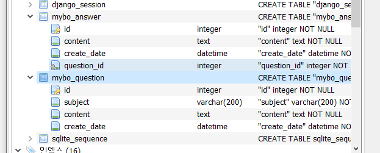

=============================================================================

#### 10. 데이터 생성/저장/조회

##### 1) 장고 쉘 실행

`(mysite) C:\Users\19178\project\mysite>python manage.py shell`

```
Python 3.8.6 (tags/v3.8.6:db45529, Sep 23 2020, 15:52:53) [MSC v.1927 64 bit (AMD64)] on win32
Type "help", "copyright", "credits" or "license" for more information.
(InteractiveConsole)
>>>
```

`from mybo.models import Question, Answer`


##### 2) Question클래스의 질문(객체) 생성하여 데이터베이스(질문 테이블)에 저장

```
from django.utils import timezone
q=Question(subject="질문제목", content="질문내용", create_date=timezone.now())
q.save()
```


##### 3) 질문 데이터 확인, 전체 데이터 객체 확인


```
>>> q
<Question: Question object (2)> (:저장 순서에 맞게 저절로 id가 생김)
>>> q.id
2
>>> Question.objects.all()
<QuerySet [<Question: Question object (1)>, <Question: Question object (2)>]>
```


##### 4)모델 내용 변경시 장고 쉘 재시작

<QuerySet [<Question: Question object (1)>, <Question: Question object (2)>]>

은 객체가 잘 보이지 않음 => Question객체에 method 추가후 장고 쉘 종료했다가 재접속

```:
def __str__(self)
	return self.subject(출력하고 싶은 속성 ex. content, create_date)
```

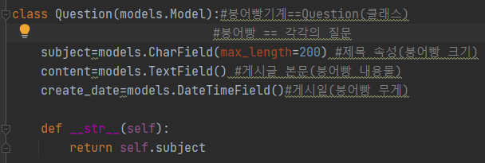

```
quit()
python manage.py shell
from mybo.models import Question, Answer
Question.objects.all()

<QuerySet [<Question: mybo가 뭔가요?>, <Question: what is django model?>]>
```

* ##### makemigrations, migrate 명령을 사용하는 경우 

-모델 속성 추가 혹은 변경

* ##### shell 종료후 재접속하는 경우

단순 메소드만 추가하는 경우

====================================================================

##### 5-1)  id로 특정 데이터 참조하기

```
>>> Question.objects.filter(id=1)	#(id=1에 해당하는 여러 자료를 다 확인, list구조)
<QuerySet [<Question: mybo가 뭔가요?>]>
>>> Question.objects.get(id=1)		#(id=1에 해당하는 한 건의 데이터만 가져옴)
<Question: mybo가 뭔가요?>
```
Question.objects.filter(id=3)

```
# 없는 자료를 참조해도 error가 나오지 않고 비어있는 list가 출력됨

>>> Question.objects.filter(id=3)
<QuerySet []>
```
Question.objects.get(id=3)

```
# 없는 자료를 참조하면 DoesNotExist에러가 발생

>>> Question.objects.get(id=3)
Traceback (most recent call last):
  File "<console>", line 1, in <module>
  File "C:\Users\19178\venvs\mysite\lib\site-packages\django\db\models\manager.py", line 85, in manager_method
    return getattr(self.get_queryset(), name)(*args, **kwargs)
  File "C:\Users\19178\venvs\mysite\lib\site-packages\django\db\models\query.py", line 429, in get
    raise self.model.DoesNotExist(
mybo.models.Question.DoesNotExist: Question matching query does not exist.
```

5-2)  속성에 특정 단어를 포함한 데이터 참조

```
>>> Question.objects.filter(subject__contains='mybo')  #subject는 는 속성명
<QuerySet [<Question: mybo가 뭔가요?>]>
```


#### 11. 데이터 변경 및 삭제

* 쉘에서 데이터 속성 변경하기

```
>>> Question.objects.get(id=2)
<Question: what is django model?>

>>> q=Question.objects.get(id=2)		#object를 q 변수에 저장
>>> q.subject="Django Model Question"	#subject 변경
>>> q.save()   							#save() 반드시 해줘야 반영됨

>>> q
<Question: Django Model Question> 		#변경내용 확인
>>> Question.objects.get(id=2)
<Question: Django Model Question>
```

* 데이터 삭제하기

```
>>> q.delete()				#mybo.Question에서 1개가 삭제되었다 라는 뜼
(1, {'mybo.Question': 1})	#삭제의 경우에는 따로 save()해주지 않아도 됨

```


* cf) 모델간 연결(models.ForeignKey()함수 사용) +on_delete=models.CASCADE 옵션

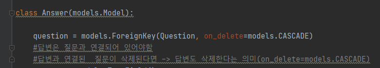

```
on_delete=models.CASCADE #질문이 제거되면 동시에 답변도 삭제된다는 의미
```

```
>>> q=Question.objects.get(id=1)
>>> from django.utils import timezone

>>> a=Answer(question=q, content="the answer of question no2", create_date=timezone.now())	#객제 생성
>>> a.save()					#저장 필수

>>> a							#데이터 확인
<Answer: Answer object (1)>
>>> a.id
1
>>> Answer.objects.get(id=1)
<Answer: Answer object (1)>
```

* 속성 참조하기(답변과 연결된 질문)

```
>>> a.question
<Question: mybo가 뭔가요?>
>>> a.create_date
datetime.datetime(2021, 2, 2, 7, 21, 16, 49547, tzinfo=<UTC>)
```

* 질문과 연결된 답변 확인하기(foreignkey로 연결된 모델의 데이터를 조회할 수 있음)

  (질문 => 답변)

```
>>> q.answer_set.all()		# _set.all(): 질문에 연결된 답변은 여러개일 수 있음
<QuerySet [<Answer: Answer object (1)>]>
```


#### 12. 관리자 계정 만들기

```
(mysite) C:\Users\19178\project\mysite>python manage.py createsuperuser

사용자 이름 (leave blank to use '19178'): admin
이메일 주소: admin@mysite.com
Password:
Password (again):
비밀번호가 너무 짧습니다. 최소 8 문자를 포함해야 합니다.
비밀번호가 너무 일상적인 단어입니다.
비밀번호가 전부 숫자로 되어 있습니다.
Bypass password validation and create user anyway? [y/N]: y
Superuser created successfully.
```

localhost:8000/admin 접속 후 관리자 계정 로그인

#### 13. admin 페이지에 mybo 추가하고, GUI로 질문 추가해보기

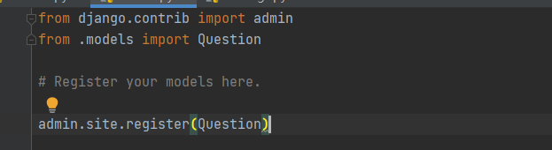

```
mybo\admin.py

from django.contrib import admin
from .models import Question     #models.py에서 Question 클래스를 받아서

# Register your models here.

admin.site.register(Question)    #admin.site에 등록
```

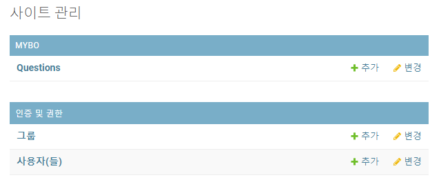


#### 14. admin page에 검색모델 만들기

클래스 Question.Admin 만들고 register에 추가

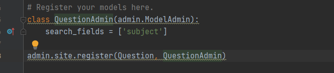


#### 15. template 적용하기( http://localhost:8000/mybo/)

##### 1) mybo\views.py 에서 Question class 설치후 index 함수에서 작업하기

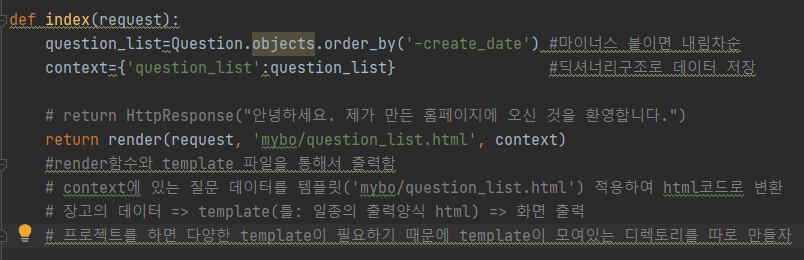

##### 2) template 디렉토리 만든 후 템플릿 만들기(mybo/question_list.html)

mysite에 templates dir  생성

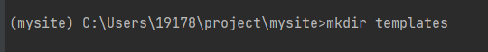

templates 디렉토리 추가해주기 (config\settings.py)

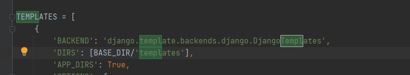

templates 폴더 밑에 mybo 폴더 생성후 question_list.html 만들기

```
<!--템플릿 태그: html문서 내부에 동적인 코드를 삽입하기 위해 사용되는 태그-->
<!--템플릿 태그는 로 둘러쌓인 문장-->
```

```

    <ul>
    
        <li><a href="/mybo/{{ question.id }}/">{{ question.subject }}</a></li>
    
    </ul>

    <p>질문이 없습니다.</p>

```

```
* 템플릿 태그 작성 양식

    <p>조건문1에 해당되는 경우</p>

    <p>조건문2에 해당되는 경우</p>

    <p>조건문1, 2에 모두 해당되지 않는 경우</p>




    <p>순서: {{ forloop.counter }} </p>
    
<!--    <p>순서: {{ forloop.counter }} 1부터시작</p>
		<p>순서: {{ forloop.counter0 }} 0부터 시작</p>
        ==> for 문의 순서를 1부터 표시
        {{}}은 화면에 내용을 그대로 출력하는 기능
        퍼센트는 html내에서 그 동작을 실행하는 기능
-->
    <p>{{ item }}</p>

```

#### 16.url 매핑하기

#### views에서 매핑된 url에 적용할 method 작성하기

#### 작성한 method를 render하는데 필요한 템플릿 만들기

1)question_list.html 만들기

2)question_detail.html 만들기


```
작동순서

1.html://localhost:8000/mybo/4 요청

2.config.urls.py로 간다음 거기서 mybo.urls.py로 이동

3.여기서 url매핑을 함 path methon활용, views.index로 보내짐

4.views.py로 가보면 index메소드가 정의되어야함

5.index메소드를 보면 return render(request,템플릿,적용할내용(context))가 적혀있음

6.<이 사이에서 config의 settings로 가서 Template의 경로를 설정>

7.템플릿을 적용하기 위해 templates 디렉토리 내의 적용template.html로 이동

8.이 내용대로 출력됨
```


#### 16-1. 404에러페이지가 뜰 때

views.py 수정하기

```
from django.shortcuts import render, get_object_or_404
question =get_object_or_404(Question,pk=question_id)

#정상적인 요청이면 200코드 반환
#응답코드 500대 서버내부의 오류
#응답코드 4로시작:주소의 오류, 이름의 변경등 경로상의 문제
```

#### 16-2. url 매핑 별칭설정(하드코딩 NO, url주소 변경시 효율적으로 수정하자!)

```
urls.py로 이동하여 app_name과 path name속성을 지정하여 별칭 설정

app_name='mybo'
urlpatterns=[
    path('',views.index,name='index'),
    path('<int:question_id>/',views.detail,name='detail'),
    ]
```

```
/mybo/{{ question.id }} 를 "" 이렇게 변경
```

```
mysite(학교)
mybo(app_name=반1)			myboo(app_name=반2)	  
index(id:index)		index(id:index)		<=id의 중복이 발생함
detail(id:detail)	detail(id:detail)	<=네임스페이스 부여, 즉 반의 이름을 또 부여
```

#### 질문에 매칭되는 답변 출력

답변을 입력하고 submit하면  action에 입력한 url로 내용이 전송되고

해당 url매핑을 통해 연결된 지정된 views파일 method로 이동한다

**1.출력할 템플릿에 form태그로 frontend 내용 작성**

여기서 action이 submit버튼 눌렀을 때 전송이 되는 url 통로

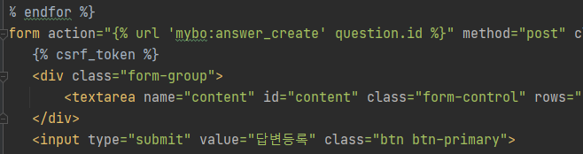

**2.  urls.py에서 저 url 통로의 도착지를 지정해줘야함**

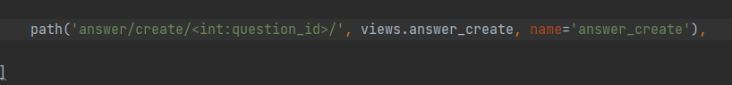

**3. 도착지에서 사용할 함수를 정의**

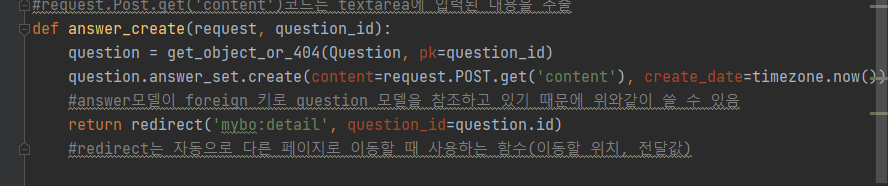


**4. redirect 를 통해서 다시 mybo:detail url을 매핑**

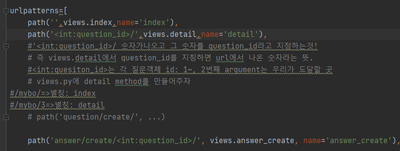

**5. 매핑을통해서 다시 views.detail로 연결**

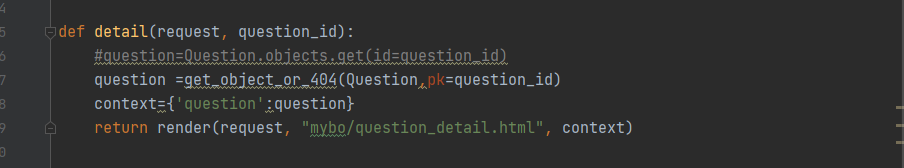

**6. views.detail로 다시 template연결해서 출력**

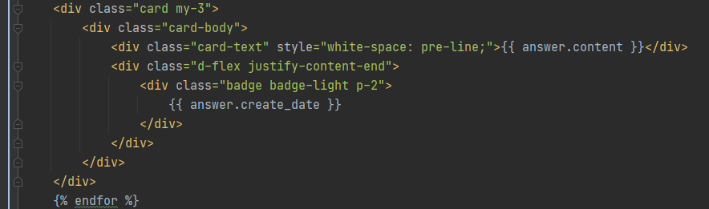


**이동한 메소드에서 내용을 받아 객체를 생성, db에 저장**

**question_detail.html**

```
<form action="" method="post">

<textarea name="content" id="content" rows="15"></textarea>
<input type="submit" value="답변등록">
</form>
```


#### css 및 부트스트랩 적용하는법

1. mkdir static(static 폴더 생성)
2. settings.py 마지막에 

```
입력해주기
STATICFILES_DIRS = [
    BASE_DIR / 'static',
]
```


3. getbootstrap.com/docs/4.5/getting-started/download

4. 에서 다운로드후 압축 풀고 css폴더의 bootstrap.min.css을 프로젝트 static 폴더 안에 넣어주기

5. 적용하고 싶은 템플릿에 가서 다음과 같이 작성하기

```

<link rel="stylesheet" type="text/css" href="">
```

