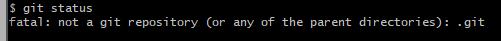
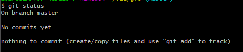
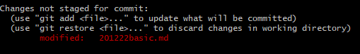
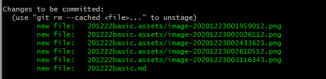
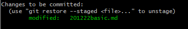
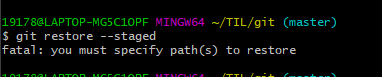

# Github 특강 - Basic

## git 이란?

### What

git은 SCM(source code manager), 혹은 VCSs(버전 컨트롤 시스템)

버전 관리가 가능한 폴더라고 생각하면 됨

github은 이러한 폴더들의 클라우드 개념

### why

github을 배우는 이유는 오픈소스 커뮤니티에 참여하기 위해서임

github은 개발자들의 sns, 클라우드, 채용사이트


## git 설치 및 실행

1. `git-scm.com` 에서 다운로드
2. 계속 next 로 설치
3. 윈도우 탐색창에 `git bash` 클릭


## git 사용법

### 최초 설정

#### 이름, 이메일 설정

```
$ git config --global user.name "<당신의 이름>"

$ git config --global user.email "<당신의>@<이메일>"

```

#### 확인

```
$ git config user.name
이름 출력

$ git config user.email
이메일 출력
```


### 상태 점검

```
$ git status
```

#### 일반 폴더인 경우



#### git인 경우

##### 파일이 없을 때



##### 파일 생성 o, add x

untracked files: 생성했지만 등록하지 않은 처음보는 파일(stage에 없기 때문에 commit x)


##### 파일 생성 o, add o, 변경o, add x

변경 사항을 add하지 않음, commit 불가능




##### 파일 생성 o, add o



##### 파일 생성 o, add o, 변경 o, add o

##### 


### 초기화


#### git init

```
$ git init
기본 폴더에 버전관리 기능 추가 (master)

$ ls -a 로 확인해보면 .git이 추가된 것을 볼 수 있음
```

#### 일반 폴더

```
$ rm -rf .git 으로 추가된 .git만 삭제해주면 됨
```


### add하기(Stage위로 올리기)


#### 파일 만들기

`$ touch <파일명.확장자>` 파일 만들기

#### stage로 올리기

`$ git add .` 내 현재 위치를 add

`$ git add <파일명.확장자>` add 파일만 


### Commit 하기(사진을 찍기)


`$ git commit -m 'commit message'`

commit message는 변경 내용을 식별할 수 있도록 설정하기


### Log 보기

`$ git log`


## Summary & 기타

### Summary

git init >> git add >> git commit

| 명령어                             | 설명                                                |
| ---------------------------------- | --------------------------------------------------- |
| `$ git init`                       | 빈 디렉토리(폴더)를 git 저장소(repo)로 초기화 한다. |
| `$ git add <filename>`             | `<filename>`을 Stage 에 올린다.                     |
| `$ git commit -m "commit message"` | commit message로 사진을 찍는다.                     |


### 기타

#### typora 활용하여 md 파일 작성하기

| 명령어           | 설명                   |
| ---------------- | ---------------------- |
| 컨트롤 + 1,2,3,4 | 대제목, 중제목, 소제목 |
| 1. 2. 3. ...     | ordered list           |
| \|a\|b\|         | 표만들기               |
| ``               | 작은 blank 만들기      |
| ``` + enter      | 큰 blank 만들기        |

#### github 명령어

| 명령어               | 설명                       |
| -------------------- | -------------------------- |
| ~                    | 홈폴더                     |
| cd -                 | 뒤로가기                   |
| cd ..                | 위로가기                   |
| taptap               | 이름 불러오기              |
| esc >> :q!           | git commit 상태 빠져나오기 |
| mv <1> <2>           | 1번 파일 2번으로 이름변경  |
| rm <1>               | 1번 파일 삭제하기          |
| git restore          | 복구?                      |
| git restore --staged | modifed 상태 이전으로 회귀 |

### 질문

git restore --staged




git restore 

