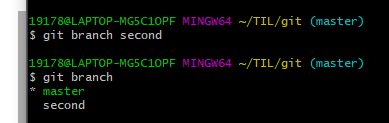

# git - intermediate

## git-되돌리기

### 커밋 재작성

```
$ git commit --amend: (가장 최근 commit 수정, 수정 + 커밋결합)
1. i or insert :입력가능
2. commit message 변경
3. esc
4. :wq

#vim으로 md파일 편집하는 것도 동일
```

#### restore

```
$ git restore <파일명> : 변경사항 되돌리기
$ git restore --staged <파일명> : Unstage로 변경하기
```


## github활용하기

### remote 저장소 생성, 추가

```
1. github 회원가입 (코딩 전용 gmail 개설 추천)
2. 오른쪽 상단에 + 표시 클릭후 New repository 클릭
3. repo name과 Description 작성 후 publc/private 설정 , 밑에 checkbox 3개는 모두 비워두기
4. repo create이 완료되면 http주소 복사
5. $ git remote add origin(리포이름) http주소
```

```
하나의 local repo를 여러개의 remote repo와 연동할 수 있음
$ git remote rm 추가리포 (remote repo 지우기)
$ git remote -v (상태확인)
origin  https://github.com/seo1511kr/TIL.git (fetch)
origin  https://github.com/seo1511kr/TIL.git (push)
```

```
remote repo 지우기
$ git remote rm 추가리포
```


### remote 저장소에 push & pull

```
$ git clone <remote 주소> (주의: 반드시 홈에서 clone)

$ git push origin master  (origin은 repo 이름, master는 브랜치 이름)

github을 클라우드처럼 활용하기

```


## git-브랜치

### 브랜치 생성하기

```
$ git branch  <branch 이름>
```

### 브랜치 확인하기

```
$git branch
```



### 브랜치 옮기기

```
$ git switch  <branch 이름>

$ git switch -c <branch 이름>
branch + switch : branch를 생성하고 바로 새로운 브랜치로 이동 
```


### 브랜치 합치기(git merge)

```반드시 master 위치에서!
주의: 반드시 master 위치에서!

$ git switch master

$ git merge <branch 이름>
merge하기 이전에는 master git log에는 branch의 commit들이 기록되지 않음
```

### 브랜치 삭제하기

```
$ git branch -d <branch 이름>
```


## 협업하기1(master push)

```
1. 협업 폴더 만들기
2. git init으로 버전컨트롤 기능 부여
3. github에서 remote repo 생성
4. git remote add <이름> <주소>로 연동
5. remote repo에서 setting 맨 밑에 manager access로 초대하기
6. 초대받은 사람은 홈폴더에서 git clone <주소>로 먼저 git을 가져오기

```

```
#conflict가 발생할 때
2번이 수정하여 push 후 1번이 그 수정사항을 pull하지 않고 본인도 새로운 내용을 추가하여 push한 경우에는 reject당함
>> 이 경우에는 pull을 먼저 해야함
```


## 협업하기2(branch 활용)

### 1. vs code 활용하기

```
다운로드 (check box 2,3,5 체크)
컨트롤 `
기본셸 선택, git bash, 휴지통
상단 메뉴바o >> 저장 안했다는 뜻
c>> conflict
```

### 2.  각자 branch 생성 & push

```
A협업자 $ git branch branch_a
	   $ git push origin branch_a(이제부터 origin이 대장이됨)
B협업자 $ git branch branch_b
	   $ git push origin branch_b(이제부터 origin이 대장이됨)

#협업에서 conflict 해결
뒤늦게 pull request 할때 아마 reject가 뜰거임
손으로 고쳐주면됨
```


## .gitignore

```
#굳이 git을 쓰지 않아도 되는 파일들(ex. logfile)
ex. 바꾸지 않았는데도 계속 modified로 인식되는 파일들

$ git rm --cached logfile (이미 add 된 애들을 untracked 상태로)
하나하나 코딩하는 것 비효율적

https://gitignore.io
에서 사용하는 언어 서칭후 복사 붙여넣기(.gitignore에) 이후 저장하면 회색으로 변함

원하는 폴더, 우클릭, git bash here를 이용하면 한번에 위치 이동할 수 있음

```

