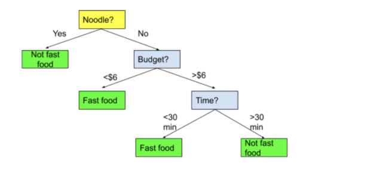

### 트리형 지도학습 모델(의사결정나무, 랜덤포레스트,그래디언트 부스팅)

#### 1. 의사결정나무(가장 기초, 분류, 회귀, 탐색에 모두 사용가능)

##### 개념: 스무고개와 비슷, 각 독립변수 요인이 질문으로 주어지고 그 값에 따라서 나뉨

##### 용어:

```
1. root node
2. decision node(intermediate node)
3. Leaf node(terminal node)
```




##### 형성과정: 

```
1. 분리기준
2. 정지기준
3. 가지치기(과대적합 방지)
4. 타당성평가
```

##### 분리기준: 목표변수(종속변수,label) 구별하는 정도(순수도, 불순도)에 의해 결정됨

	1. ##### 이산형.범주형(분류): 지니 지수(디폴트), 엔트로피 지수,  카이제곱 통계량 p-value

```
정보획득량: 노드 분리(질문에 대답) 이후에 줄어든 엔트로피(무질서한 정도) 값
정보획득량이 큰 질문을 먼저 던짐
```

```
from sklearn.datasets import load_iris


data = load_iris()
y = data.target
X = data.data[:, 2:]
feature_names = data.feature_names[2:]

from sklearn.tree import DecisionTreeClassifier

tree1 = DecisionTreeClassifier(criterion='entropy', max_depth=1, random_state=0).fit(X, y)

criterion: 정보획득량 기준,
overfitting을 맊기 위한 규제 => 너무 많은 가지 치는 것 방지
1. max_depth: 변수 개수 제한
2. max_leaf_nodes: 생성될 최대 leaf node 제한
3. min_samples_leaf: 특정 샘플 이하로는 가지치기 불가능

feature_importances_ 속성을 통해 feature별 중요도 조회 가능
탐색과정에서 중요한 feature를 찾기 위해 decision tree 이용하기도 함.

tree1.feature_importances_ #array로 출력됨 , pd.Series로 옮겨 닮은 뒤, plot 그려서 시각화
```


​	2. 연속형(회귀): 목표변수의 평균과 펴준편차에 기초

##### 특징

```
장점:
1. 해석의 용이성
2. 교호작용효과의 해석
3. 비모수적 모형(선형, 정규 or 등분산성 가정 필요 없음)

단점:
1. 비연속성(독립변수, 질문이 연속 변수라면 경계 부분에서 오류 가능성 높음)
2. 비안정성(새로운 데이터 예측시), 과적합이 일어나기 쉬움
3. 선형성 , 주효과의 결여
```


### 2. 앙상블 기법(랜덤포레스트: 투표방식, 그래디언트부수팅: 부스팅방식)

#### 2-1랜덤포레스트

다수의 결정트리를 사용해서 성능을 올린 앙상블 알고리즘

여러개의 트리를 만듬(n_estimators=으로 지정, 많을 수록 좋지만 시간이 오래걸림)

	1. 각 트리는 부트스트랩 샘플링으로 데이터샛 준비
	2. 전체 피처중 일부의 피처만 랜덤하게 지정
	3. 각 트리별로 예측결과를 산출하고 그 예측결과에서  분류는 다수결 투표,  회귀는 평균
	4. 과적합 방지 파라미터들은 의사결정트리와 동일(max_depth,min_samples_leaf,..)


#### 2-2 그라디언트 부스팅

부스팅: 단순 약한 학습기를 결합해서 강력한 학습기를 만드는 방식

하나의 트리 깊이(max_depth<=5)를 보통 5 이하(약한 학습기)로 잡음 -> 메모리 사용이 적음

매개변수 설정에 더 민감함(랜덤포레스트 대비)

스케일 조정 필요없음, 이진. 연속트리에서 모두 잘 동작

n_estimators가 커지면 과적합 가능성이 높아짐(랜덤포레스트와는 다름)

learning_rate: 약한 학습기를 보정하는 비율=> 보정이 강할수록 모델이 복잡해짐(과적합가능성)

보통은 가용한 시간과 메모리 한도에서 n_estimaorts를 맞추고 적절한 learning_rate 찾음.