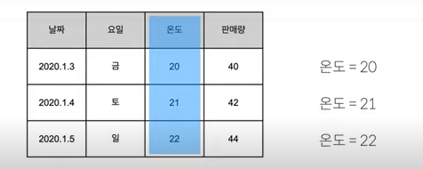
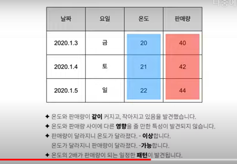
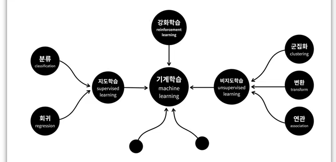
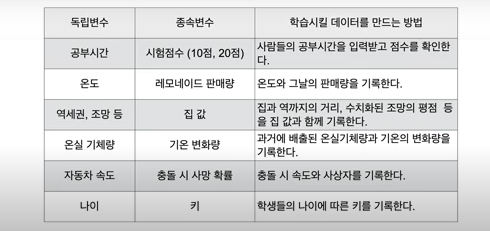
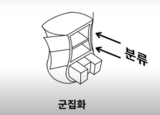
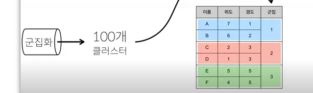
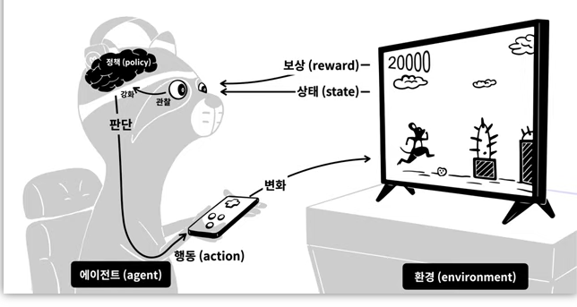
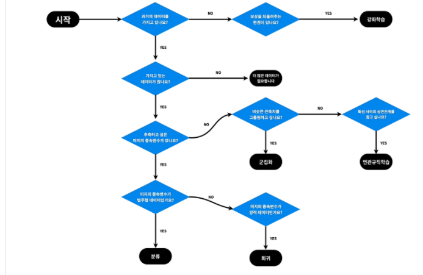

# 머신러닝 기초

## 1. 표

복잡한 데이터를 구조화=> ( 행(row)과 열(col) )

#### 1-1행= 개체, 관측치, 기록, 사례, 경우

#### 1-2열= 특성, 변수, 속성, field

각 행(관측치)마다의 속성들

## 2. 독립변수와 종속변수

#### 2-1변수: variable, 변할 수 있는

x=1, x=2 처럼 변수는 계속 새로운 값으로 변화할 수 있음

표에서 col은 변수이다. 온도라는 특성은 각 관측치 별로 계속 변화함

#### 2-2원인(독립변수)과 결과(종속변화)

원인: 결과와는 관계없이 독립적으로 발생함

결과: 원인에 의해 종속적으로 발생함

#### 2-3상관관계와 인과관계

=>인과관계는 독립변수와 종속변수의 관계

인과관계가 있으면 상관관계는 무조건 성립, 그 역은 성립 x

* 온도(x)와 판매량(y)은 상관관계가 있다:

  x의 변화 => y의 변화(가능), y의 변화 => x의 변화(가능)

* 온도(x)와 판매량(y)은 인과관계가 있다:

  x의 변화 => y의 변화(가능),  y의 변화 => x의 변화(불가능)

## 3. 머신러닝의 분류

기계학습 

[지도학습, 비지도학습, 강화학습,]

#### 3-1지도학습(분류, 회귀)

정답이 있는 문제를 해결하는 것

#### 3-2비지도학습(군집화, 변환, 연관)

데이터에대한 통찰을 부여함. 스스로 관찰하고 의미를 파악

#### 3-3 강화학습

학습을 통해 능력을 향상, 지도학습과는 다르게 정답이 없는 상황에서

끊임없이 경험하며 더욱 성장함

## 4. 지도학습(과거 -> 미래)

지도학습은 역사와 비슷함, 즉 과거의 데이터를 통해 결과를 예측함

ex. 새벽배송 수요예측과 같은 상황

* 독립변수와 종속변수의 관계를 학습시키면 컴퓨터가 그 관계를 설명할 수 있는 공식(패턴)을 만들어냄 

* 원인 -> 모델 -> 결과예측

* 머신러닝= 공식의 대중화(천재들만의 전유물이었던 새로운 공식을 누구든지 만들 수 있음)

## 5. 회귀 vs 분류(지도학습)

#### 5-1회귀: 독립변수와 종속변수가 있고, 종속변수가 숫자일 때

ex) 온도로 판매량 예측, 역 도달 거리로 집값 예측, 나이로 키 예측 등...

#### 5-2분류: 독립변수와 종속변수가 있고, 종속변수가 이름일 때

ex)사진=> 손톱(정상/비정상), 데이터 ->(양성/음성)

## 6. 군집화(비지도 학습)

#### 6-1군집화(clustering) vs 분류(classification)

* 군집화: 비슷한 행을 그룹핑, 즉 그룹을 만드는 것

  (ex. 배달 구역을 각각 그룹으로 만드는 것)

* 분류: 만들어진 그룹에 각 대상들을 집어넣는 것

#### 6-1연관규칙학습(장바구니 학습)

: 특성(열:col)을 그룹핑 해주는 것  <->군집화: 관측치(행)을 그룹핑 해주는 것

#### 6-3총정리

1. 비지도학습: 탐험적

독립변수와 종속변수의 구분이 중요하지 않음.

=> 대상의 성질을 파악, 비슷한 것은 모으고 다른 것은 떨어트림

=> 데이터를 정리정돈하여 그 표에담긴 데이터의 성격을 파악

2. 지도학습: 역사적

과거의 데이터를 바탕으로 미래 결과를 추측

(원인:독립변수)					(결과:종속변수)

## 7. 강화학습(reinforcement)

경험을 통해 실력을 키워나감 <====> 지도학습:배움을 통해 실력을 키워나감

상과 벌을 반복하며 성장

- 게임  환경(environment)
- 게이머  에이전트(agent)
- 게임화면  상태(state)
- 게이머의 조작  행동(action)
- 상과 벌  보상(reward)
- 게이머의 판단력  정책(policy)

어떤 환경(field)에서 다양한 상태를 반복하여 경험하고

그 경험에서 상,벌(reward)를 받고 이러한 결과를 관찰하며 상을 더 잘 받을 수 있는

판단력(policy)를 얻고 그 판단력을 바탕으로 행동하여(action) 변화된 결과를 초래함.

(오락실에서 키 막누르다 보면 어느 순간 컴퓨터정도는 이기게되는 것과 비슷함)

## 

==> 내 의견

과거의 이론, 데이터들이 미치는 영향력이 점차 축소되는 뉴노멀 트렌드에서

강화학습으로 만든 투자AI와 과거 데이터 분석을 통한 투자AI의 수익률을 비교해보고 싶은 생각이 들었음!

이번 코로나와 같은 전세계적 전염병과 같은 그간 경험하지 못해서 데이터가 없는 문제를 해결할 때에도 강화학습이 좋은 도구가 될 것.

## 8. 마무리

갖고 있는 데이터(과거 데이터 유무), 얻고 싶은 결과(종속변수의 유무, 종속변수의 타입)

에 따라 사용하는 도구가 다름.

