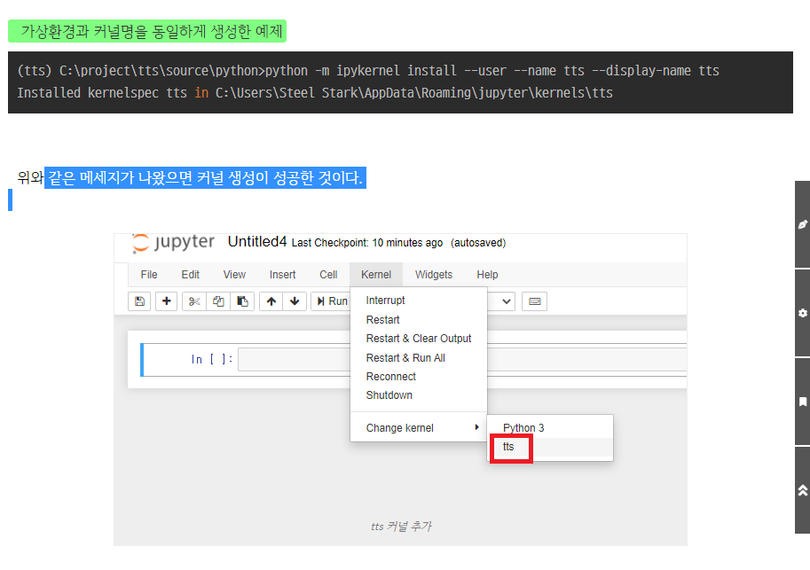

# 아나콘다 가상환경 생성, geopandas 설치

### why: geopandas는 base에 설치하게되면 의존성 문제로 에러가 잦음

#### 새로운 가상환경을 생성하여 패키지, 라이브러리 관리를 효율적으로 진행하기

#### 1. 아나콘다 prompt 실행

#### 2. 가상환경 생성

```
conda create -n 가상환경이름 python=버전
```

#### 3.conda폴더 envs 경로로 들어가면 새로 생성된 가상환경 폴더 확인가능

#### 4. 가상환경 활성화

```
conda info   #가상환경 확인
conda activate 가상환경이름  #가상환경 활성화
```

#### 5. 가상환경 비활성화

```
conda deactivate
```

#### 6. 가상환경에 라이브러리 설치

```
#geopandas 설치하면 pandas numpy등 기본 라이브러리 설치됨, 충돌방지를 위해 먼저 설치하는 것이 좋음

conda install geopandas #가상환경 들어가서 설치
conda install -n 가상환경이름 geopandas #가상환경 밖에서 설치
```

#### 7. 라이브러리 확인하기

```
conda list
```

#### 8. 가상환경 복사하기

```
conda create -n 복사된_가상환경이름 --clone 복사할_가상환경이름
```

#### 9. 가상환경 삭제하기

```
conda remove -n 가상환경이름 --all
```

#### 10. 라이브러리(패키지)관리

```
pip freeze > requirements.txt  #requirements.txt에 라이브러리 정보 저장(저장경로는 prompt 경로)
```

#### 11. 동일한 라이브러리 재구성

```
pip install -r requirements.txt #재구성
pip uninstall -r requirements.txt #삭제
```

#### 12. 새로 형성한 가상환경과 주피터 노트북 연결

```
가상환경 활성화 후
pip install jupyter
pip install ipykernel

python -m ipykernel install --user --name 가상환경 --display-name 커널명
커널명은 (주피터에서 보여질 가상환경 명칭)
```




###  결론

```
프로젝트 혹은 분석 방법에 따라 라이브러리 목록을 정리해두면
프로젝트 진행 시 충돌로 낭비되는 시간을 절약할 수 있겠다.

gis분석과 같은 작업에서 사용할 라이브러리 목록을 만들기!
```


