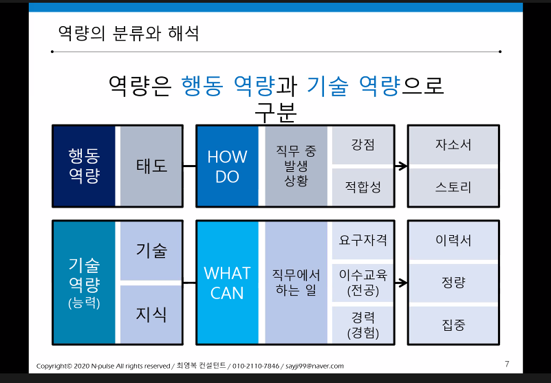
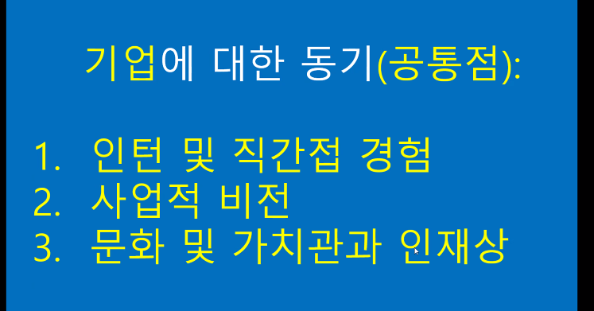

## Q & A

#### 1. 직무관련 경험이 없을때

```
반드시 직무지식 관련 경험일 필요는 없다. 데이터분석 직군이라면 단순 분석이라는 행위를 했던 경험을 적으면 됨.
```

#### 2. 수치적인 결과물은 없지만 경험이 있는 경우

```
수치는 정확하지 않아도 가늠할 수 있을 정도로는 써주는 것이 좋다.
```


#### 3. 지원동기 & 입사 후 포부

##### 제품, 고객, 시장 측면에서 회사와의 일치성 찾아내기)

```
어떤 상품(보험,펀드,예적금 등) 어떤 고객(중년, 노인, 청년 등) 어떤방법으로?
ex ) 보험분야에서 밀레니얼 세대를 위한 서비스를 기획하는데 일조하고 싶습니다.(관련경험: 특출난 경험일 필요는 없음, 밀레니얼 세대를 겨냥했던 경험)
```

```
반대로 가고싶은 기업을 먼저 조사하고 (제품,서비스) 내 경험을 맞춰도 됨.
KB손해보험에서 현재 밀고있는 비전 => 나의 가치관 => 우리가 앞으로 할 것
```

##### 준비과정

```
얼마나 오랫동안이 아닌 지원시점부터 얼마나 몰입하여 준비했는지.
능력중심: 자격증 취즉, 관련 수업 수강
정성적인 지표: 진정성이 있는 부분(진짜 열정을 보여줘야함) => 직접 발품을 판 경험(영업 지점 방문 등)
```

##### 입사 후 포부(how to plan: 목표 & 방법론이 명확해야 한다.)

```
목표만 나열하는 경우 신빙성이 떨어짐, 방법론을 반드시 넣어줄 것. 어떻게 직무를 배울 것인지?
1. 장기적인 비전: 가치관과 일관되도록 포괄적인 관점에서 자세할 필요는 없음.
2. 단기적인 목표: 나의 부족한 부분, 어떻게 극복?(EX. 코딩능력 -> 학원 수강 등)
```


#### 4. 팀 활동 활용(고객, 팀원, 선후배와의 갈등을 반드시 포함시킬 것)

##### => 공모전 주제 지정, 학술대회 주제 선정(팀원과의 갈등, 선후배와의 갈등)

##### => 갈등 (1. 의사충돌, 2. 효율성 극대화 추구를 위한 헌신)


#### 5. 이력서  > 자기소개서, 자기소개서는 1번째 질문이 가장 중요.

```
유통,BtoC,제약 등은 자기소개 많이 봄, 기업에서는 SK는 자기소개서 많이 봄.
```


#### 6. 진로 변경에 대해서

```
그만둔 이유보다는 새롭게 시작한 이유에 초점을 맞출 것!.
계리사를 관둔 이유보다, 왜 데이터분석 직군을 새롭게 선택했는지?

=> 주제에 얽메이지 않고 다양한 분야에 걸쳐 새로운 인사이트를 뽑아내야 하는 것이 매력적이었다.
=> 처음에는 디지털 역량을 보완하는 차원에서 강의를 수강했었는데 코딩을 할 때는 시간가는 줄 모르고 재밌더라, 새로운 가설을 만들고 분석을 시도하여 원하는 결과가 나왔을 때 정말 짜맀하고, 컴퓨터가 내가 시키는데로 작동하는게 재밌다. 그래서 진로를 변경했다.

```


#### 7. 자격증 공부 경험

```
계리사 자격증을 공부한 이유 => 보험산업에 대해 체계적으로 이해하고 관련 분야의 전문가가 되고 싶었다.전문가까지 이뤄내지는 못했지만, 보험회사가 무엇을 팔고 어떠한 방식으로 수익을 내는지는 확실하게 이해할 수 있었다. 
```


#### why(왜 지원했는지? 왜 했는지?) 

#### whom(수요와 공급 이해하기, 채용의 목적 생각해보기)

##### 단순 빅데이터로 접근시: 통계적 능력이 가장 중요함.

##### 어떤 데이터를 분석하여 어디에 사용할 지 생각하기.

##### 금융=> 고객 편의성 증대, 고객 맞춤형, (타겟팅, 도메인에대한 이해)=>어떤 니즈를 파악하여 어떤 식으로 해결했는지.

#### what 

#### how(특정 역량을 강조할 때는 나의 지원직무에서 필요한 상황과 결을 맞추는 경험이 좋다, 조직과 조직, 부서와 부서, 조직과 고객 등 상황을 맞춰야함)


#### 여러가지 역량보다는 하나의 컨셉을 확실하게 하는 것이 좋을수도.(강점, 능력, 가치관 각 1개씩 딱 정해보기)

#### 주제는 행동역량, 컨텐츠는 직무 역량(부서간 커뮤니케이션을 주제로 이야기 할 때, 어떤 컨텐츠? 마케팅과 관련되었던 경험, 오히려 전공 관련 수업을 활용하는 것도 좋음)




#### 




1
대기업
https://www.ftc.go.kr/www/selectReportUserView.do?key=10&rpttype=1&report_data_no=8548
2
폭 넓게
https://www.catch.co.kr/Comp/CompTheme?GubunCode=
3
스타트업
https://www.wanted.co.kr/wdlist/518?country=kr&job_sort=job.latest_order&years=0&locations=all
4
외국계기업
https://www.peoplenjob.com/jobs?type=new-recruits
5
중견-중소-강소기업
https://www.work.go.kr/empInfo/indRev/indRevMain.do


#### 금융업계 -> 어떻게 돈 벌꺼니? 영업 마인드가 항상 깔려있어야함

##### 비즈니스, 세일즈에 관한 부분을 항상 준비하기=> 잘 팔아봤음을 강조(고객중심을 강조하면 좋을듯)

##### 코딩테스트 난이도는 별로 안높음-> 쉽게 접근하기, 질병코드, 아프기전에 대비할 것인가?

##### 빅데이터 + 질병에 관한 프로젝트 (iot 서비스와 융합 프로젝트)

##### 수익 극대화, 지출 최소화(KB 손해보험은 지출을 최소화 시키고자 하는 쪽)

##### 간소화


#### 은행의 수익구조 변화 -> 플랫폼 기반의 부가적인 수익 창출에 대한 고민

#### 내가 생각하는 고객지향, 글로벌 인재 등을 재해석 해보기


#### 자유양식 => 보수적인 회사: 기본 형식

#### 자유양식 => 진취적인 회사: 나를 돋보일 수 있게


#### 지원동기와 준비과정

1. 나열형(팩트 나열): 전공과 지원분야가 일치할 때

#### 입사 후 포부, 성장 목표

##### 직무와 직접적인 연관이 없어도 자연스럽게 연결지어 작성 가능함


#### 성장과정 간략히 기술, 나에게 영향끼친 사건(큰 실패 혹은 성공)

##### 나에게 영향끼친 사건을 메인으로 서술 -> 나에게 ~한 인물(사건)은 ~다. 그 가치관을 통해 ~했기 때문이다.

##### 큰 사건이 없다면, 잔잔바리로 가족에서의 사사로운 일로 스타트를 끊고 추후 어떤 사건으로 다시 확인하게 되는 방식으로 작성

##### 가치관과 역량 질문을 연결시켜 일관되게 작성하면 좋음(일치하지 않을 경우 재해석해서 일치시키는 방법도 있음.)

##### 역량을 기술할 때는 반드시 반대급부적인 상황이 제시되어야 함.(분석력-방대한 양, 부족한 시간 등)

##### 전문역량은 일반 역량과의 차이점: 전문역량은 오로지 기술과 지식으로 하나를 특정해서

##### 조직생활에서 가장 중요하다고 여기는 가치는 무엇이며, 왜 그렇게 생각하는지 서술하여 주시기 바랍니다. => 개인과 회사가 모두 성장할 수 있는 비즈니스적 마인드

##### 1등 보험사가 되기 위한 최고의 고객서비스는 무엇이며, 이를 위한 본인의 역할을 서술하여 주시기 바랍니다.=> 내 가치관과 일치시키는 방향으로, 꼭 KB손해보험에서 진행중인 사업일 필요는 없음, 입사후 포부는 단순 장기적인 미래 비전뿐 아니라 내가 부족한 부분을 어떻게 보완할지에 대한 단기적인 목표들도 풀어나가는 것이 좋음.

##### 질문이 길 경우 하나씩 끊어서 모든 조건을 만족시킬 수 있도록 작성하는 것이 중요함!


##### 타인의 가치 향상? => 공모전, 고객니즈 파악 경험

##### 금융사에서 갈등관계 => 1순위 고객과의 갈등 2순위 팀워크

##### 프로젝트에서 역할을 기능적으로 나누지 말고 조금 더 구체적으로 나누기

##### 성장한 시점에서 이전의 활동들을 다시 리뷰하고 재구조화 시키기

##### 보고서 형식(정보전달)

##### 학업 이외의 열정 => 진짜로 좋아하는 것 쓰기

##### 경쟁상대 => 좀 더 포괄적인 관점으로 접근: 플랫폼 사업자


#### 1. 타겟설정(요구사항 분석)

#### 2. 경험정리/역량정의

#### 3. 역량 우선순위 결정(3~10개)

#### 4. 질문 별 스토리 구성

#### 5. 자소서/면접 스크립트 맞춤 구성

#### 6. 컨셉 결정/ 실행 및 훈련


#### 1. 타겟 설정: 금융권(보험사 위주)

#### 2. 경험정리/역량정의

상황: 구체적으로 날짜, 공모전 주제,

과제: 목표, 지표를 우선적으로 제시 이후 역할 책임

행동: 극복해야될 요소, 핵심적인 문제를 파악학


Facts: 팩트만 나열하기 보다는 현재의 시점에서 재구성하여 작성하자.

Feelings: 그동안 너무 사실만 전달하듯 작성했던 거 같다.

Findings: 내 경험을 재구성하여 경험들 사이에 나만의  통찰력을 보완해야겠다.

Future: 각 항목별로 새롭게 경험을 재구성하고 나만의 차별점을 만들어봐야겠다.

##### 개인 활동:

```
어플 출시:
의류 사업:
```


##### 공모전:

```
수상

생명보험 사회공헌 위원회 개최 사회공헌사업 공모전(장려상) => 분석 , 조화(공동의 목표 추구)
=> 두루뭉실한 주제를 쪼개서 구체화, 공모전 관련 주체 (보험사, 사회공헌위원회, 타겟고객)

교내 계량경제 학술대회(장학금100만원)=> 응용(자산->부동산), 조화(선후배)
=> 키 페이퍼를 정해서 가정과 변수들의 의미를 파헤쳐 봄, 


교내 혁신교육센터 문제해결 공모전(우수상)

참여

국민카드 서비스 기획

한국보험신문개최 대학생 아이디어 공모전
```

##### 인턴:

```
미르컨설팅손해보험중개(영업지원)
원수사 요율산출서 자사 양식으로 재작성

```


##### 학업

```
통계학과 복수전공

```

##### 자격증

```
보험계리사 1차합격
빅데이터분석기사(딸 예정)
```


| 주요 경험사건                                                | 상황(Situation) | 과제(Task) | 행동(Action) | 결과(Result) | 배운 점(Lessons) |
| ------------------------------------------------------------ | --------------- | ---------- | ------------ | ------------ | ---------------- |
| <필요역량><br />분석                                         |                 |            |              |              |                  |
| <필요역량><br />열정, 추진력, 도전                           |                 |            |              |              |                  |
| <필요역량><br />상생, 조화, 고객지향<br /> + 비즈니스적 마인드 |                 |            |              |              |                  |
| <필요역량><br />가치관(조화로운 성장)                        |                 |            |              |              |                  |
| <필요역량><br />차별화된 강점                                |                 |            |              |              |                  |
|                                                              |                 |            |              |              |                  |
|                                                              |                 |            |              |              |                  |
|                                                              |                 |            |              |              |                  |


